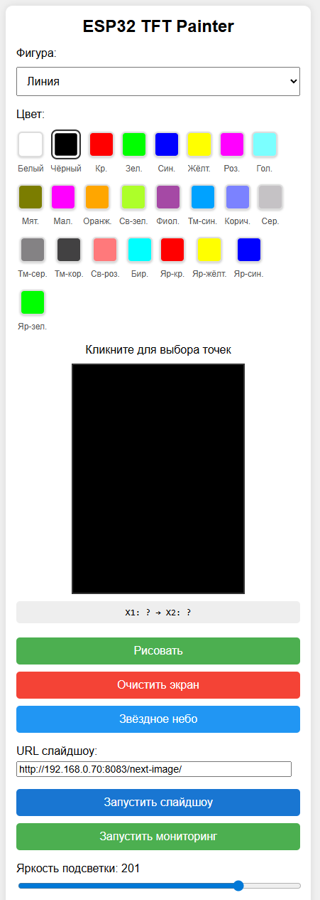
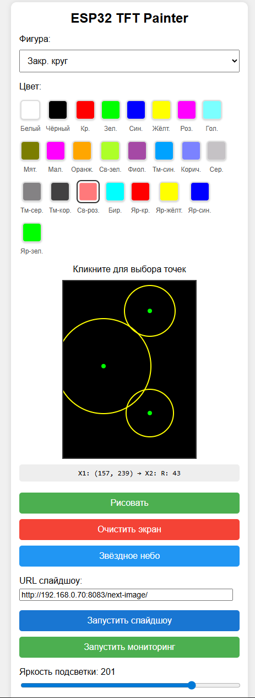

Понял вас, исправил форматирование. Теперь каждая команда находится в отдельном блоке, а описание вынесено за их пределы, чтобы код не сливался с текстом.

---

# ESP32 TFT Web Painter & Slideshow

Проект дистанционного управления TFT-дисплеем (ILI9341 и аналоги) через ESP32 с использованием веб-интерфейса и внешнего сервера изображений.




## 🚀 Возможности
* **Web Control:** Управление яркостью подсветки и отрисовкой фигур через браузер.
* **Image Streaming:** Автоматическое слайдшоу из локальной папки на ПК.
* **Auto-compression:** Скрипты для сжатия веб-интерфейса для экономии памяти ESP32.
* **Sensors:** Поддержка датчика MQ135 для мониторинга качества воздуха.

## 📁 Структура проекта
* `LCD.ino` — Прошивка для ESP32 (Arduino IDE).
* `image_server.py` — Сервер на FastAPI для подготовки и раздачи изображений.
* `convert_to_gz.py` — Утилита для конвертации HTML в заголовочный файл `.h`.
* `index_html.html` — Исходный UI веб-панели.

---

## 🛠 Инструкция по развертыванию

### 1. Подготовка прошивки
1. Откройте `LCD.ino` в Arduino IDE.
2. Установите библиотеки: `LovyanGFX`, `ArduinoJson`, `MQ135`.
3. Настройте параметры Wi-Fi в коде.
4. Скомпилируйте и загрузите прошивку в ESP32.

### 2. Запуск сервера изображений
Для работы режима слайдшоу необходимо запустить сервер на компьютере, где лежат изображения:

1. Установите зависимости:
```bash
pip install fastapi uvicorn pillow
```

2. Укажите путь к папке с картинками в `image_server.py` (переменная `IMG_DIR`).

3. Запустите сервер через `image_server.cmd` или напрямую:
```bash
python image_server.py
```

### 3. Обновление интерфейса
Если вы изменили `index_html.html`, обновите заголовочный файл одной командой:
```bash
python convert_to_gz.py index_html.html index_html_gz.h
```

---

## 🔌 Схема подключения
* **Дисплей:** SPI (Standard ESP32 pins).
* **Подсветка (Backlight):** Управляемый ШИМ пин (настраивается в коде).
* **Датчик MQ135:** Аналоговый вход.

> ⚠️ **ВНИМАНИЕ:** Не подключайте пин VCC дисплея к 5V, используйте только 3.3V!

* **Датчик MQ-135:** VCC -> 5V (Vin), GND -> GND, AOUT -> GPIO 34.
* **Дисплей (SPI):**
    * VCC -> 3.3V
    * MOSI -> GPIO 32
    * SCK -> GPIO 35
    * CS -> GPIO 25
    * D/C -> GPIO 33
    * RST -> GPIO 26
    * LED (Подсветка) -> GPIO 13 (через резистор 100-220 Ом)

## 🛠 Технологический стек
* **C++ (Arduino)** — логика микроконтроллера.
* **Python (FastAPI)** — сервер обработки изображений.
* **JavaScript/HTML/CSS** — клиентский интерфейс.
* **GZIP** — компрессия данных.
